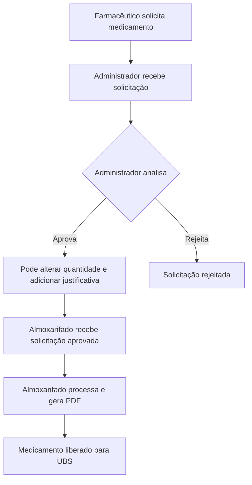
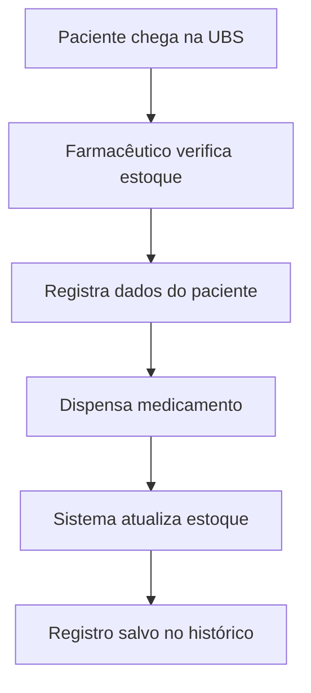

# 🏥 SemsaControl - Sistema de Controle de Medicamentos

<div align="center">
  
  
  
  
</div>

<div align="center">
  <h3>Sistema completo para controle e gestão de medicamentos e utensílios médicos</h3>
  <p>Desenvolvido para otimizar o fluxo de distribuição entre almoxarifado central e unidades básicas de saúde (UBS)</p>
</div>

---

## 📋 Índice

- [Sobre o Projeto](#-sobre-o-projeto)
- [Funcionalidades](#-funcionalidades)
- [Tecnologias](#-tecnologias)
- [Instalação](#-instalação)
- [Como Usar](#-como-usar)
- [Perfis de Usuário](#-perfis-de-usuário)
- [Fluxo do Sistema](#-fluxo-do-sistema)
- [Estrutura do Projeto](#-estrutura-do-projeto)
- [Contribuição](#-contribuição)
- [Licença](#-licença)

---

## 🎯 Sobre o Projeto

O **SemsaControl** é um sistema web moderno desenvolvido para gerenciar o controle de medicamentos e utensílios médicos em secretarias municipais de saúde. O sistema facilita o fluxo de distribuição entre o almoxarifado central e as unidades básicas de saúde (UBS), proporcionando:

- ✅ **Controle de estoque** em tempo real
- ✅ **Gestão de validades** e alertas automáticos
- ✅ **Fluxo de aprovação** estruturado
- ✅ **Relatórios detalhados** em PDF
- ✅ **Dispensação para pacientes** controlada
- ✅ **Rastreabilidade completa** de movimentações

---

## 🚀 Funcionalidades

### 📦 **Gestão de Estoque**
- Cadastro de medicamentos e utensílios médicos
- Controle de estoque por localização (Almoxarifado + UBS)
- Alertas automáticos para estoque baixo
- Monitoramento de validades com notificações

### 🔄 **Fluxo de Solicitações**
- Solicitação de medicamentos pelas UBS
- Aprovação pelo administrador com possibilidade de alteração
- Processamento pelo almoxarifado
- Geração automática de comprovantes em PDF

### 👥 **Dispensação para Pacientes**
- Controle de dispensação direta para pacientes
- Registro com número do SUS/CPF
- Histórico completo de dispensações

### 📊 **Relatórios Avançados**
- **Relatório de Estoque**: Situação atual por local
- **Relatório de Movimentações**: Entradas, saídas e saldos
- **Relatório de Validades**: Medicamentos próximos ao vencimento
- **Relatório de Avarias**: Controle de perdas e danos
- Exportação em PDF com filtros personalizáveis

### 🔔 **Sistema de Notificações**
- Alertas de estoque baixo
- Notificações de medicamentos próximos ao vencimento
- Atualizações de status de solicitações

---

## 🛠 Tecnologias

### **Frontend**
- **React 18.3.1** - Biblioteca para interfaces de usuário
- **TypeScript 5.5.3** - Superset tipado do JavaScript
- **Tailwind CSS 3.4.1** - Framework CSS utilitário
- **React Router DOM 6.22.1** - Roteamento para React
- **Lucide React 0.344.0** - Ícones modernos
- **Date-fns 3.3.1** - Manipulação de datas

### **Build & Development**
- **Vite 5.4.2** - Build tool e dev server
- **ESLint** - Linting de código
- **PostCSS & Autoprefixer** - Processamento CSS

### **Armazenamento**
- **LocalStorage** - Persistência de dados no navegador
- **Context API** - Gerenciamento de estado global

---

## 📥 Instalação

### **Pré-requisitos**
- Node.js 18+ 
- npm ou yarn

### **Passos**

1. **Clone o repositório**
```bash
git clone https://github.com/seu-usuario/semsacontrol.git
cd semsacontrol
```

2. **Instale as dependências**
```bash
npm install
# ou
yarn install
```

3. **Inicie o servidor de desenvolvimento**
```bash
npm run dev
# ou
yarn dev
```

4. **Acesse o sistema**
```
http://localhost:5173
```

---

## 🎮 Como Usar

### **1. Primeiro Acesso**
O sistema inicializa automaticamente com dados de demonstração incluindo:
- Medicamentos e utensílios de exemplo
- Localizações (Almoxarifado Central + 3 UBS)
- Transações de exemplo
- Usuários de demonstração

### **2. Login no Sistema**
Use uma das credenciais abaixo:

| Perfil | Email | Senha | Descrição |
|--------|-------|-------|-----------|
| **Administrador** | admin@example.com | admin123 | Acesso completo ao sistema |
| **Farmacêutico** | farmacia@example.com | pharma123 | Gestão da UBS Centro |
| **Almoxarifado** | almoxarifado@example.com | warehouse123 | Controle de estoque central |

### **3. Navegação**
- **Dashboard**: Visão geral com estatísticas e alertas
- **Medicamentos**: Cadastro e gestão de medicamentos
- **Utensílios**: Cadastro e gestão de utensílios médicos
- **Solicitações**: Fluxo de aprovação de pedidos
- **Distribuições**: Histórico de movimentações
- **Relatórios**: Análises e exportações em PDF

---

## 👤 Perfis de Usuário

### 🔑 **Administrador**
**Responsabilidades:**
- Cadastro de medicamentos e utensílios
- Aprovação/rejeição de solicitações das UBS
- Alteração de quantidades solicitadas
- Acesso a todos os relatórios
- Visão completa do sistema

**Funcionalidades Exclusivas:**
- Edição de medicamentos e utensílios
- Recebimento de estoque no almoxarifado
- Relatórios gerenciais completos

### 💊 **Farmacêutico (UBS)**
**Responsabilidades:**
- Solicitação de medicamentos ao almoxarifado
- Dispensação para pacientes
- Controle de estoque da UBS
- Reporte de avarias

**Funcionalidades Exclusivas:**
- Dispensação para pacientes com registro SUS/CPF
- Solicitações ao administrador
- Visão limitada à sua UBS

### 📦 **Almoxarifado**
**Responsabilidades:**
- Processamento de solicitações aprovadas
- Controle físico do estoque central
- Geração de comprovantes de entrega
- Liberação de medicamentos

**Funcionalidades Exclusivas:**
- Processamento de distribuições aprovadas
- Geração de PDFs de entrega
- Controle de estoque do almoxarifado

---

## 🔄 Fluxo do Sistema

### **Fluxo de Solicitação**


### **Fluxo de Dispensação**


---

## 📁 Estrutura do Projeto

```
semsacontrol/
├── public/
│   └── favicon.svg
├── src/
│   ├── components/
│   │   └── layout/
│   │       ├── Header.tsx          # Cabeçalho com notificações
│   │       ├── Sidebar.tsx         # Menu lateral
│   │       └── Layout.tsx          # Layout principal
│   ├── contexts/
│   │   ├── AuthContext.tsx         # Contexto de autenticação
│   │   ├── MedicationContext.tsx   # Contexto de medicamentos
│   │   └── NotificationContext.tsx # Contexto de notificações
│   ├── hooks/
│   │   ├── useAuth.ts             # Hook de autenticação
│   │   ├── useMedication.ts       # Hook de medicamentos
│   │   └── useNotification.ts     # Hook de notificações
│   ├── pages/
│   │   ├── Login.tsx              # Página de login
│   │   ├── Dashboard.tsx          # Dashboard principal
│   │   ├── MedicationList.tsx     # Lista de medicamentos
│   │   ├── MedicationDetail.tsx   # Detalhes do medicamento
│   │   ├── UtensilList.tsx        # Lista de utensílios
│   │   ├── UtensilDetail.tsx      # Detalhes do utensílio
│   │   ├── RequestList.tsx        # Lista de solicitações
│   │   ├── DistributionList.tsx   # Lista de distribuições
│   │   ├── PatientDistribution.tsx # Dispensação para pacientes
│   │   ├── Reports.tsx            # Relatórios
│   │   └── NotFound.tsx           # Página 404
│   ├── utils/
│   │   └── seedData.ts            # Dados de demonstração
│   ├── App.tsx                    # Componente principal
│   ├── main.tsx                   # Ponto de entrada
│   └── index.css                  # Estilos globais
├── package.json
├── tailwind.config.js
├── vite.config.ts
└── README.md
```

---

## 📈 Funcionalidades Avançadas

### **Sistema de Notificações**
- Notificações em tempo real
- Alertas de estoque baixo
- Avisos de medicamentos próximos ao vencimento
- Contador de notificações não lidas

### **Relatórios Inteligentes**
- Filtros por período (anual, mensal, personalizado)
- Filtros por tipo de item (medicamentos, utensílios)
- Filtros por localização
- Exportação em PDF com formatação profissional

### **Controle de Validades**
- Monitoramento automático de datas de vencimento
- Alertas 30 dias antes do vencimento
- Identificação visual de medicamentos vencidos
- Relatório específico de validades

### **Gestão de Avarias**
- Registro de medicamentos/utensílios danificados
- Controle por localização
- Motivos detalhados de avarias
- Relatório de perdas

---

## 🔒 Segurança

- **Autenticação baseada em roles** (Administrador, Farmacêutico, Almoxarifado)
- **Controle de acesso** por funcionalidade
- **Validação de dados** em todas as operações
- **Persistência segura** no localStorage
- **Rotas protegidas** com redirecionamento automático

---

## 🎨 Interface

### **Design System**
- **Cores principais**: Tons de azul (primary) para elementos principais
- **Cores de status**: Verde (sucesso), Amarelo (atenção), Vermelho (erro)
- **Tipografia**: Sistema de fontes nativo do sistema
- **Ícones**: Lucide React para consistência visual
- **Responsividade**: Design adaptável para desktop, tablet e mobile

### **Componentes Reutilizáveis**
- Botões com variações (primary, secondary, success, warning, danger)
- Cards com sombras e bordas arredondadas
- Tabelas responsivas com paginação
- Modais com animações suaves
- Badges para status e categorias

---

## 🚀 Deploy

### **Build de Produção**
```bash
npm run build
# ou
yarn build
```

### **Preview da Build**
```bash
npm run preview
# ou
yarn preview
```

### **Estrutura de Deploy**
O sistema gera uma build estática na pasta `dist/` que pode ser servida por qualquer servidor web (Apache, Nginx, etc.).

---

## 🤝 Contribuição

Contribuições são sempre bem-vindas! Para contribuir:

1. **Fork** o projeto
2. Crie uma **branch** para sua feature (`git checkout -b feature/AmazingFeature`)
3. **Commit** suas mudanças (`git commit -m 'Add some AmazingFeature'`)
4. **Push** para a branch (`git push origin feature/AmazingFeature`)
5. Abra um **Pull Request**

### **Padrões de Código**
- Use **TypeScript** para tipagem
- Siga os padrões do **ESLint**
- Mantenha componentes **pequenos e focados**
- Documente **funções complexas**
- Escreva **commits descritivos**

---

## 📝 Licença

Este projeto está sob a licença MIT. Veja o arquivo [LICENSE](LICENSE) para mais detalhes.

---

## 📞 Suporte

Para suporte ou dúvidas sobre o sistema:

- 📧 **Email**: suporte@semsacontrol.com
- 📱 **WhatsApp**: (11) 99999-9999
- 🌐 **Site**: https://semsacontrol.com
- 📋 **Issues**: [GitHub Issues](https://github.com/seu-usuario/semsacontrol/issues)

---

## 🏆 Créditos

Desenvolvido com ❤️ para otimizar a gestão de medicamentos em secretarias municipais de saúde.

**Versão**: 1.0.0  
**Última atualização**: Setembro 2025

---

<div align="center">
  <p><strong>SemsaControl</strong> - Transformando a gestão de medicamentos com tecnologia</p>
  <p>⭐ Se este projeto foi útil, considere dar uma estrela no GitHub!</p>
</div>